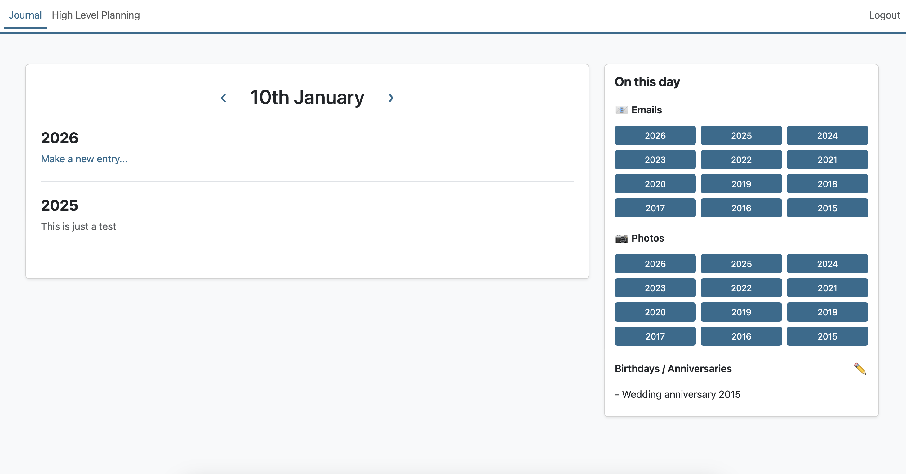
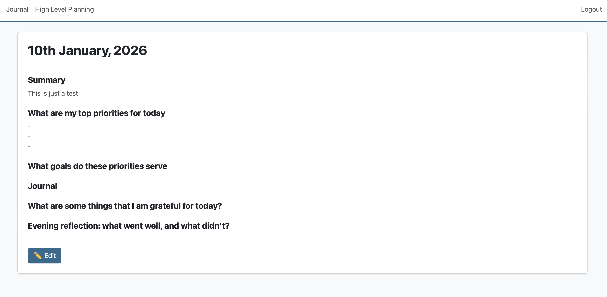
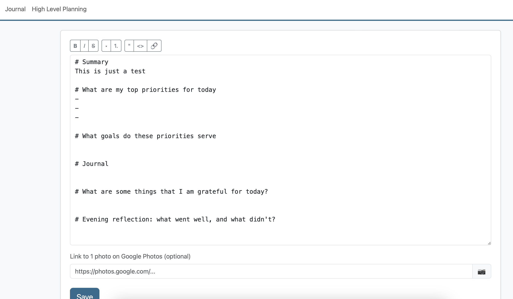
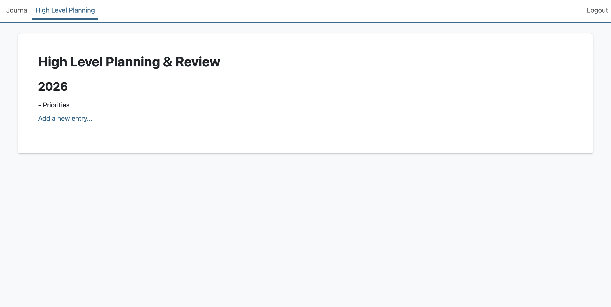

# Personal Journal Application

A simple, password-protected PHP journaling application for personal use.

## Background

A few years ago, I received a special type of diary. It had a page for each day and on each page, there was space to take notes for 10 different years. Not a lot of space, but enough to write down a quick summary of what happened on that day. It was a nice book to get, and the more notes I added to it, the more special it became. Every day, I got a reminder of what happened in my life on that exact date, one, two or more years ago.

That said, the book was pretty heavy and I was on the go a lot, and it didn't replace a journal or planning system. 

In the end of 2025, I decided to take this idea and build it into a webapp for my own personal use. It should be centered around this idea of having a quick summary of each day, but it should also allow me to use it for other things, like journaling, prioritizing things for each day, daily gratitude practice or reflection on my day. As I started building it, I had additional ideas, like including links to google photos or to Gmail, leading to photos that I had taken on that exact date some years ago or emails that I had received on that same date.

Then, a section was added for the more "high level" things, like setting priorities for a year, quarterly reviews etc. 

I used PHP for this and deliberatly decided to not use a database backend, but save all entried in .MD format. First of all, this project is for mainly intended for myself. Secondly, I want it to be as easy as possible to deply, in case someone else wants to use this. The system is not intended for multiple users - the password is simply baked into the config.php file.

Also, right now I am trying to test out a lot of different AI coding agents/ methods. I touched less than 1% of the code here myself. It was all built using the GitHub Copilot chat and it took only a couple of hours (maybe 4) to write the actual code. My approach was as follows: draw everything up using pen and paper, quick wireframes using Powerpoint. Then a description of each page. Then, I fed these things piece by piece to GitHub Copilot, tested it piece by piece and when I had additional ideas, I added these as feedback on the go.

## Screenshots





## Features

### Daily Journaling
- Simple password authentication (no database required)
- Daily journal entries organized by date (MMDD/YYYY.md format)
- Entry template with structured sections
- Summary section for quick overview
- Rich markdown support (headers, bold, italic, strikethrough, lists)
- Formatting toolbar for easy text editing

### Date Navigation & Integration
- Navigate between dates using arrow buttons or date picker modal
- Anniversary/birthday tracking per date with inline editing
- Gmail integration - quick links to emails from the past 12 years for any date
- Google Photos integration - links to photos from the past 12 years for any date
- Photo indicator icons on entries with linked photos

### High Level Planning
- Separate section for yearly planning and goal tracking
- Template-based planning entries (Goals, Projects, Habits & Systems, Health, Finance & Career, Relationships, Learning)
- Organize planning entries by year
- Full markdown support in planning entries

### User Experience
- Clean, modern Bootstrap 5 interface
- Responsive design
- AJAX-based saving (no page reloads)
- Edit existing entries
- View entry history across years

## Setup

1. **Configure Password**
   - Open `config.php`
   - Change `JOURNAL_PASSWORD` to your desired password

2. **Web Server**
   - Ensure PHP is installed (PHP 7.4+ recommended)
   - Place in your web server directory (e.g., XAMPP's htdocs)
   - Access via browser: `http://localhost/journal/`

3. **File Permissions**
   - Ensure the `entries/` and `highlevel/` folders are writable by the web server
   ```bash
   chmod -R 755 entries/ highlevel/
   ```

## Folder Structure

```
journal/
├── index.php           # Main application file and router
├── config.php          # Configuration (password, settings)
├── functions.php       # Helper functions
├── header.php          # Page header
├── footer.php          # Page footer
├── login.php           # Login view
├── dashboard.php       # Daily dashboard view
├── entry.php           # Single entry view
├── new_entry.php       # Entry editor
├── planning.php        # High level planning overview
├── planning_new.php    # Create new planning entry
├── planning_edit.php   # Edit planning entry
├── planning_view.php   # View planning entry
├── style.css           # Custom stylesheet
├── script.js           # JavaScript utilities
├── entries/            # Journal entries
│   ├── template.md     # Entry template
│   └── MMDD/           # Date folders (e.g., 0107 for Jan 7)
│       ├── YYYY.md     # Entry for specific year
│       ├── anniversaries.txt  # Birthdays/anniversaries
│       └── YYYY-photo.txt     # Google Photos link (optional)
└── highlevel/          # High level planning entries
    └── YYYY/           # Year folders (e.g., 2026)
        └── *.md        # Planning entries
```

## Entry Organization

### Daily Journal Entries
- Organized by date in MMDD format folders (e.g., `0107` for January 7th)
- Each year gets its own markdown file (e.g., `2026.md`)
- One `anniversaries.txt` file per date for recurring events
- Optional `YYYY-photo.txt` files for Google Photos links

### High Level Planning Entries
- Organized by year in the `highlevel/` folder
- Each planning entry is a separate markdown file
- Filenames are automatically generated from entry titles
- Templates provide structure for different planning areas

## Usage

### Daily Journaling

1. **Login**
   - Enter your password from `config.php`

2. **Daily Dashboard**
   - Navigate between dates using arrow buttons or click the date to open a date picker
   - View summaries of entries from previous years (up to 12 years back)
   - See anniversaries for the current date in the sidebar
   - Quick links to Gmail and Google Photos for the past 12 years
   - Photo icons (📷) indicate entries with linked Google Photos

3. **Creating Entries**
   - Click "Make a new entry..." on the dashboard
   - Use the formatting toolbar for bold, italic, strikethrough, headers, and lists
   - Write your entry using markdown syntax
   - Add optional Google Photos link
   - Save your entry (AJAX - no page reload)

4. **Editing Entries**
   - Click "View full entry" on any entry summary
   - Click the "✏️ Edit" button
   - Make changes using the formatting toolbar
   - Save changes

5. **Managing Anniversaries**
   - Click the ✏️ button next to "Birthdays / Anniversaries" in the sidebar
   - Add one entry per line
   - Save changes in the modal

### High Level Planning

1. **Access Planning Section**
   - Click "High Level Planning" in the navigation

2. **Create Planning Entry**
   - Click "Add a new entry" (only available for current year)
   - Enter a title for your planning entry
   - Select a template (Goals, Projects, Habits & Systems, Health, Finance & Career, Relationships, Learning)
   - The template provides structured sections to guide your planning

3. **Edit Planning Entries**
   - Click on any entry to view it
   - Click "✏️ Edit" to modify
   - Use markdown formatting for better organization
   - Save changes

4. **Organize by Year**
   - Planning entries are automatically organized by year
   - View entries from previous years for reflection

## Entry Template

Each new entry follows this structure:

- **Summary**: Brief overview (displayed on dashboard)
- **What are my top priorities for today**: Daily goals
- **What goals do these priorities serve**: Connection to bigger picture
- **Journal**: Main journal content
- **What are some things that I am grateful for today?**: Gratitude practice
- **Evening reflection: what went well, and what didn't?**: Daily review

## Security Notes

- This is designed for personal use on a private server
- Password is stored in plain text in `config.php`
- Uses PHP sessions for authentication
- For production use, consider:
  - Moving `config.php` outside web root
  - Using environment variables
  - Adding HTTPS
  - Implementing rate limiting

## Customization

- **Timezone**: Edit `date_default_timezone_set()` in `config.php` (default: Europe/Zurich)
- **Colors**: Modify Bootstrap theme variables in `style.css` (primary color: `#2c6b8e`)
- **Journal Template**: Edit `entries/template.md` to customize entry sections
- **Planning Templates**: Templates are defined in `planning_new.php`
- **Gmail/Photos Years**: Adjust the range in `dashboard.php` (currently 12 years)

## Markdown Support

The application supports the following markdown syntax:

- **Headers**: `# H1`, `## H2`, `### H3`
- **Bold**: `**bold text**`
- **Italic**: `*italic text*`
- **Strikethrough**: `~~strikethrough~~`
- **Lists**: Lines starting with `- item`
- **Line breaks**: Single line break = `<br>`, double line break = new paragraph

## Future Enhancements

- Export functionality (PDF, backup)
- Search capability across all entries
- Tags/categories for entries
- Attachment support
- Mobile app integration
- Data visualization and insights

## Troubleshooting

**Login not working:**
- Check password in `config.php` matches exactly
- Ensure PHP sessions are enabled

**Entries not saving:**
- Check `entries/` and `highlevel/` folder permissions
- Ensure web server has write access
- Check browser console for JavaScript errors

**Date picker not showing:**
- Ensure Bootstrap JavaScript is loaded
- Check browser console for errors
- Clear browser cache

**Styles not loading:**
- Clear browser cache
- Check file paths in browser console

## License

Personal use only. Feel free to modify and adapt to your needs.
